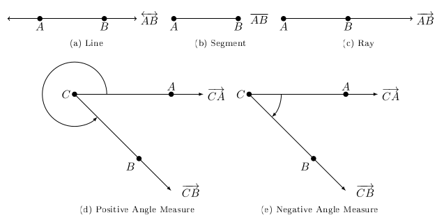

# Section 1.1

:::{prf:definition} Angles
:label: defAngles

Two distinct points $A$ and $B$ where a line passes through them is called $\overleftrightarrow{AB}$.

The portion of the line between $A$ and $B$, including $A$ and $B$, is called a line segement, denoted $\overline{AB}$.

The portion of the line $\overleftrightarrow{AB}$ that starts at $A$ and passes through $B$ is called the ray $\overrightarrow{AB}$. The point $A$ is called the end point.

An angle consists of two rays in a plane with a common end point.

:::

An **angle** consists of two rays in a plane with a common endpoint, or two line segments with a common endpoint. Each of these two rays (or segments) are called **sides** of the angle. The common endpoint is called the **vertex**. Angle is measured by rotating a ray starting at one side (the **initial side**) and ending at the other side (the **terminal side**). The positive direction of this rotation is counter-clockwise. It is also possible to complete more than one revolution.

The notation $m(\angle A)$ is ``the measure of angle $A$'' where $A$ is the endpoint and vertex to the two existing rays.

There are 360 equal partitions to complete a single rotation, we call these partitions **degrees**. Each degree has 60 equal partitions called *minutes**. Each minute has 60 equal partitions called **seconds**.

An angle measuring between $0^{\circ}$ and $90^{\circ}$ is an **acute angle**. An angle measuring exactly $90^{\circ}$ is a **right angle**. An angle measuring more than $90^{\circ}$ but less than $180^{\circ}$ is an **obtuse angle**. An angle measuring exactly $180^{\circ}$ is a **straight angle**.

When the sum of two angles equal $90^{\circ}$ we say they are **complementary** and the two angles are **complements** of each other.

When the sum of two angles equal $180^{\circ}$ we they are **supplementary** and the two angles are **supplements** of each other.

\begin{align*}
1^{\circ} & =\dfrac{1}{360}\text{ revolutions}\\
1' & =1\text{ minute}=\left(\dfrac{1}{60}\right)^{\circ}\\
1'' & =1\text{ second}=\left(\dfrac{1}{60}\right)'=\left(\dfrac{1}{3600}\right)^{\circ}
\end{align*}

An angle in **standard position** if its vertex is at the origin
and its initial side lies on the positive $x$-axis.

Angle measures that differ by a multiple of $360^{\circ}$ are coterminal angles.