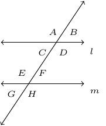
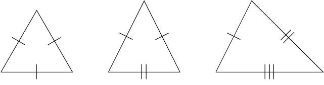

# Section 1.2

Given:

An example of alternate interior angles would $E$ and $D$. This also means that $E=D$.

An example of alternate exterior angles would be $A$ and $H$. This means $A=H$.

From the image above would should know that $D+F=180^{\circ}$. Further, $F=B$.

The sum of the measures of the angles of any triangle is $180^{\circ}$.

Definition 1.4. The following triangles are named from left to right: Equilateral, Isosceles, and Scalene.

$\triangle ABC$ is **similar** to $\triangle DEF$ if the following conditions hold true:
1. Corresponding angles have the same measure.
2. Corresponding sides are proportional.