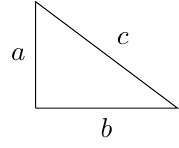
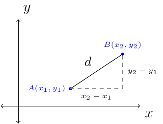
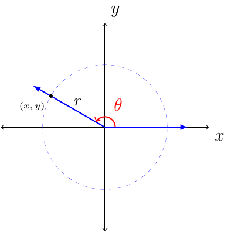

# Section 1.3

:::{prf:property}
:label: PythThm

If a triangle is a right triangle, then $a^2+b^2=c^2$.

If the sides of a triangle satisfy $a^2+b^2=c^2$, then the triangle is a right triangle.
:::

By Pythagorean Thoerem we have the following distance forumla:

$$d(A,B)=\sqrt{(x_2-x_1)^2+(y_2-y_1)^2}$$

From the image notice that $r=\sqrt{x^2+y^2}$.

The following definition is associated with the above image showing a point in space with a radius and angle, $\theta$.

{prf:definition}
:label: trigDef1

Let $(x,y)$ be a point other than the origin on the terminal side of angle $\theta$ in standard position.

The distance from the point to the origin is $r=\sqrt{x^2+y^2}$. The six trigonometric functions of $\theta$ are as follows.

\begin{align*}
    \cos(\theta) & =\frac{x}{r} & \sin(\theta)=\frac{y}{r} & \tan(\theta)=\frac{y}{x}\text{ (x\ne0)}\\
    \sec(\theta) & =\frac{r}{x} & \csc(\theta)=\frac{r}{y} & \cot(\theta)=\frac{x}{y}\text{ (y\ne0)}
\end{align*}
