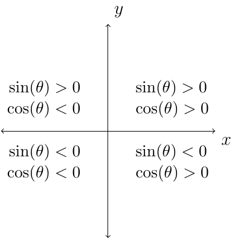

# Section 1.4

:::{prf:definition} Identities
:label: idDef

Identities are equations that are true for all values of the variables for which all expression are defined.
:::

:::{prf:definition} Reciprocal Identities
:label: recipID

For all angles $\theta$ for which both functions are defined, the following hold true:

\begin{align*}
    \sin (\theta) & = \frac{1}{\csc(\theta)} & \cos(\theta) & = \frac{1}{\sec(\theta)} & \tan(\theta) & = \frac{1}{\cot(\theta)}\\
    \csc(\theta) & = \frac{1}{\sin(\theta)} & \sec(\theta) & = \frac{1}{\cos(\theta)} & \cot(\theta) & = \frac{1}{\tan(\theta)}
\end{align*}
:::

Remember in general $f(5x)\ne 5f(x)$. This is also true for trig functions. 

$$\cos(2x) \ne 2\cos(x)$$

Similarly,

$$\cos(x+y) \ne \cos(x)+\sin(y)$$

The signs for the sine and cosine function are as follows.

