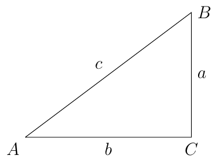
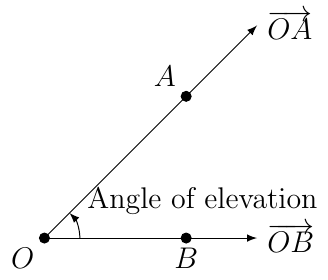
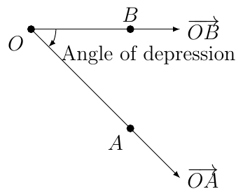
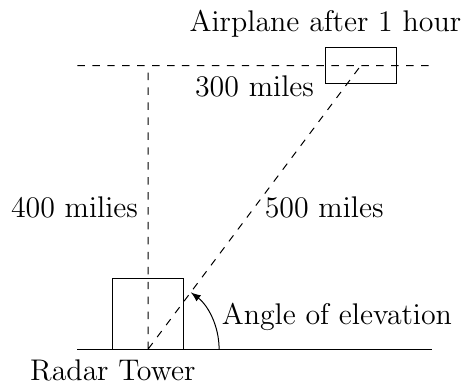

# Section 2.4

## Solving Triangles

To solve a triangle means to find the measures of all the angles and sides of the triangle.

::::{prf:example}
:label: solveTriExam1

If $a=\sqrt3$ and $m(\angle A) = 60^{\circ}$, solve the triangle.

:::{dropdown} Solution:

Since $\angle A$ measures $60^{\circ}$ and $\angle C$ measures $90^{\circ}$, we know that

$$
m(\angle B)=180-60-90=30^{\circ}.
$$

This means $\triangle ABC$ is similar to a $30-60-90$ triangle, call it $\triangle ABC^{*}$ where $a^{*}=\sqrt{3}$, $b^{*}=1,$ and $c^{*}=2$. Since the two triangles are similar we know

$$
\dfrac{a^{*}}{a}=\dfrac{b^{*}}{b}=\dfrac{c^{*}}{c}.
$$

Since $a=\sqrt{3}$, $a^{*}=1$, and $b^{*}=\sqrt{3}$ we solve for $b$

$$
\dfrac{\sqrt{3}}{\sqrt{3}}=\dfrac{\sqrt{3}}{b}\to b=\sqrt{3}\cdot1=\sqrt{3}
$$

and solve for $c$

$$
\dfrac{\sqrt{3}}{\sqrt{3}}=\dfrac{2}{c}\to c=2\cdot1=2
$$
:::
::::

::::{prf:example}
:label: solveTriExam2

If $b=\sqrt{2}$ and $m(\angle B)=45^{\circ}$, solve the triangle.

:::{dropdown} Solution:

Since $\angle B$ measures $45^{\circ}$ and $\angle C$ measures $90^{\circ}$, we know that

$$
m(\angle A)=180-45-90=45^{\circ}.
$$

This means $\triangle ABC$ is similar to a 45-45-90 triangle, call it $\triangle ABC^{*}$ where $a^{*}=1$, $b^{*}=1$, and $c^{*}=\sqrt{2}$. Since the two triangles are similar we know

$$
\dfrac{a}{a^{*}}=\dfrac{b}{b^{*}}=\dfrac{c}{c^{*}}.
$$

Since $b=\sqrt{2}$ we know that

$$
\dfrac{\sqrt{2}}{1}=\dfrac{a}{1}\to a=\sqrt{2}
$$

and

$$
\dfrac{\sqrt{2}}{1}=\dfrac{c}{\sqrt{2}}\to c=\sqrt{2}\cdot\sqrt{2}=2.
$$
:::
::::

::::{prf:example}
:label: solveTriExam3

If $c=4$ and $m(\angle A)=30^{\circ}$, solve the triangle.

:::{dropdown} Solution:

Since $\angle A$ measures $30$ and $\angle C$ measures $90^{\circ}$, we know that

$$
m(\angle B)=180-30-90=60^{\circ}.
$$

This means $\triangle ABC$ is similar to a 30-60-90 triangle, call it $\triangle ABC^{*}$ where $a^{*}=1$, $b^{*}=\sqrt{3}$, and $c^{*}=2$. Since the two triangles are similar we know

$$
\dfrac{a}{a^{*}}=\dfrac{b}{b^{*}}=\dfrac{c}{c^{*}}
$$

Since $c=4$, $c^{*}=2$, and $b^{*}=\sqrt{3}$, we have

$$
\dfrac{4}{2}=\dfrac{b}{\sqrt{3}}\to b=2\cdot\sqrt{3}=2\sqrt{3}
$$

and when $a^{*}=1$, we have

$$
\dfrac{4}{2}=\dfrac{a}{1}\to a=2\cdot1=2
$$
:::
::::

## Angle of Elevation/Depression

Let $O$ be the point at the origin. Let $A(x_{1},y_{1})$ and $B(x_{2},0)$ be points where $y_{1}\ne0$ and $x_{1}\cdot x_{2}>0$ ($x_{1}$ and $x_{2}$ share the same sign). Then there exists to rays, $\overrightarrow{OA}$, which is not horizontal and $\overrightarrow{OB}$ which is horizontal.

* When $y_{1}$ is positive then we say the angle between the two rays is an **angle of elevation**.

* When $y_{1}$ is negative then we say the angle between the two rays is an **angle of depression**.

::::{prf:example}
:label: airplaneExam1

An airplane passes a radar tower and is traveling at a constant speed of 300 miles per hour on a horizontal path with altitude $400$ miles.

Find the distance from the plane to the radar tower one hour after the plane has passed over the radar tower.

:::{dropdown} Solution:

We know that after one hour the plane has traveled 300 miles since the plan is moving at 300 miles per hour. By Pythagorean Theorem we then know that the distance from the plane to the radar site is 500 miles.
:::

What is the angle of elevation? Leave your answer in terms of a trigonometric equation.

:::{dropdown} Solution:

$$
\tan(\theta)=\dfrac{400}{300}\text{ or }\tan(\theta)=\dfrac{4}{3}.
$$

Using a calculator this is about $53.13010235415598...^{\circ}$.
:::
::::