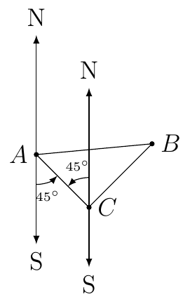
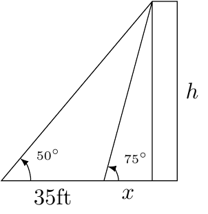

# Section 2.5

::::{prf:example}
:label: 25appExam1

Building B is shorter than Building A. Standing on top of Building B (and closest corner to Building B) there is an angle of elevation of $60^{\circ}$ from the top of Building B to the top of Building A. There is an angle of depression from the top of Building B to the
bottom of Building A of $30^{\circ}$. If Building A is $100$ meters tall then how tall is Building B?

:::{dropdown} Solution:

First, we will draw a picture.

We want to solve for $h_1$.

We know that the difference between the heights of the two buildings is $\Delta h=h_{2}-h_{1}$ and it's positive because $h_{2}>h_{1}$. This means that $h_{1}=h_{2}-\Delta h$ where $h_{2}=100$ which is given. Let $\Delta x$ be the distance between the two building on
the horizontal axis. Then we know

$$
\tan(\theta_{1})=\dfrac{\Delta h}{\Delta x}\text{ and }\tan(\theta_{2})=\dfrac{h_{1}}{\Delta x}
$$

$$
\begin{cases}
\Delta x & =\dfrac{\Delta h}{\tan(\theta_{1})}\\
\Delta x & =\dfrac{h_{1}}{\tan(\theta_{2})}
\end{cases}
$$

Since the distance between the two building is the same we have

\begin{align*}
\dfrac{\Delta h}{\tan(\theta_{1})}=\dfrac{h_{1}}{\tan(\theta_{2})} & \to\dfrac{h_{2}-h_{1}}{\tan(\theta_{1})}=\dfrac{h_{1}}{\tan(\theta_{2})}\\
 & \to\dfrac{h_{2}}{\tan(\theta_{1})}-\dfrac{h_{1}}{\tan(\theta_{1})}=h_{1}\cot(\theta_{2})\\
 & \to h_{2}\cot(\theta_{1})=h_{1}\cot(\theta_{2})+h_{1}\cot(\theta_{1})\\
 & \to\dfrac{h_{2}\cot(\theta_{1})}{\cot(\theta_{2})+\cot(\theta_{1})}=h_{1}
\end{align*}

Since $h_{2}=100$, $\theta_{1}=60^{\circ}$, and $\theta_{2}=30^{\circ}$, we first want to evaluate $\cot(60^{\circ})$ and $\cot(30^{\circ})$. Recall

$$
\cot(\theta)=\dfrac{\cos(\theta)}{\sin(\theta)}
$$

\begin{align*}\theta_{1} & =60^{\circ} & \theta_{2} & =30^{\circ}\\
\cos(60) & =\dfrac{1}{2} & \cos(30) & =\dfrac{\sqrt{3}}{2}\\
\sin(60) & =\dfrac{\sqrt{3}}{2} & \sin(30) & =\dfrac{1}{2}\\
\cot(60) & =\dfrac{1}{\sqrt{3}}\text{ or }\dfrac{\sqrt{3}}{3} & \cot(30) & =\sqrt{3}
\end{align*}

\begin{align*}h_{1}=\dfrac{h_{2}\cot(\theta_{1})}{\cot(\theta_{2})+\cot(\theta_{1})} & \to h_{1}=\dfrac{100\cot(60^{\circ})}{\cot(30^{\circ})+\cot(60^{\circ})}\\
 & \to h_{1}=\dfrac{100\cdot\dfrac{1}{\sqrt{3}}}{\sqrt{3}+\dfrac{1}{\sqrt{3}}}\\
 & \to h_{1}=\dfrac{\dfrac{100}{\sqrt{3}}}{\frac{3+1}{\sqrt{3}}}\\
 & \to h_{1}=\dfrac{100}{4}=25
\end{align*}

Therefore the height of Building B is 25 meters.
:::
::::

::::{prf:example}
:label: 25appExam2

Radar station A and B are on an east-west line, 8.6 km apart. Station A detects a plan at $C$, on bearing of $60^{\circ}$. Station B simultaneously detect the same plane, on a bearing of $330^{\circ}$. Find the distance
from B to C.

:::{dropdown} Solution:

First, we will draw a picture.

From the given information we know that $\angle CAB=30^{\circ}$ and $\angle CBA=330-270=60^{\circ}$. Therefore, $\triangle ABC$ is a 30-60-90 right triangle.

We can then step up the following equation and solve for $a$

\begin{align*}
\sin(30^{\circ}) & =\frac{a}{8.6}\\
a & =8.6\sin(30^{\circ})\\
 & =8.6\cdot\frac{1}{2}\\
 & =4.3
\end{align*}
:::
::::

::::{prf:example}
:label: 25appExam3

A ship leaves port and sails on a bearing of S$45^{\circ}$E for 2.5 hours. It then turns and sails on a bearing of N$45^{\circ}$E for 3 hours. If the ship's rate is 18 knots (nautical miles per hour), find the distance that the ship is from port.

:::{dropdown} Solution:

First, we will draw a picture of the information.

Second, we must show that $\triangle ABC$ is a right triangle. By alternating interior angles we know the following:

With the previous image we then now that $\triangle ABC$ is a right
triangle since $45^{\circ}+45^{\circ}=90^{\circ}$.

Next, we will use the information to find the length of $AC$ and $BC$. We want to find $AB$. By Pythagorean's Theorem we know 

$$
(AC)^{2}+(BC)^{2}=(AB)^{2}
$$

We are given that the first part of the travel is 2.5 hours at 18 knots. Therefore,

$$
AC=2.5(18)=45.0
$$

Similarly, we know the second part is 3 hours at 18 knots. Therefore,

$$
BC=3(18)=54
$$

Therefore,

\begin{align*}
AB & =\sqrt{45^{2}+54^{2}}\\
 & =9\,\sqrt{61}\approx70.29
\end{align*}
:::
::::

::::{prf:example}
:label: 25appExam4

Bob needs to find the height of a building. From a given point on the ground, he finds that the angle of elevation to the top of the building is $75^{\circ}$. He then walks back 35 feet. From the second point, the angle of elevation of the top of the building is $50^{\circ}$. Find the height of the building in exact form.

:::{dropdown} Solution:

First, we will draw a picture:

We want to solve for $h$. We know

\begin{align*}
\tan(50^{\circ}) & =\dfrac{h}{35+x}\\
\tan(75^{\circ}) & =\dfrac{h}{x}
\end{align*}

Solving for $h$ for both equations we have

\begin{align*}
h & =35\tan(50^{\circ})+x\tan(50^{\circ})\\
h & =x\tan(75^{\circ})
\end{align*}

Next, setting the right hand side of the two equations equal to each
other we have:

$$
35\tan(50^{\circ})+x\tan(50^{\circ})=x\tan(75^{\circ})
$$

Solve for $x$ we have

\begin{align*}
35\tan(50^{\circ})+x\tan(50^{\circ}) & =x\tan(75^{\circ})\\
35\tan(50^{\circ}) & =x\tan(75^{\circ})-x\tan(50^{\circ})\\
 & =x\left(\tan(75^{\circ}-\tan(50^{\circ})\right)\\
\dfrac{35\tan(50^{\circ})}{\tan(75^{\circ})-\tan(50^{\circ})} & =x
\end{align*}

Since $h=x\tan(75^{\circ})$ we have

\begin{align*}
h & =\dfrac{35\tan(50^{\circ})}{\tan(75^{\circ})-\tan(50^{\circ})}\cdot\tan(75^{\circ})\\
 & =\dfrac{35\tan(50^{\circ})\tan(75^{\circ})}{\tan(75^{\circ})-\tan(50^{\circ})}\\
 & \approx61.2798
\end{align*}

Therefore, the exact height of the building is

$$
\dfrac{35\tan(50^{\circ})\tan(75^{\circ})}{\tan(75^{\circ})-\tan(50^{\circ})}
$$

and the approximate height is 61.2798 feet.
:::
::::