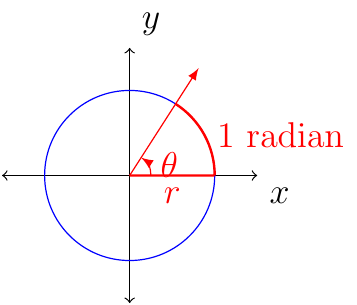

# Section 3.1

:::{prf:definition} Radians
:label: defRads

An angle with its vertex at the center of a circle that intercepts an arc on the circle equal in length to the radius of the circle has a measure of 1 radian.

:::

Given that $360^{\circ}=2\pi\text{ radians}$ for simplicity we notice that $180^{\circ}=\pi\text{ radians}$. This means that

$$
1^{\circ}=\dfrac{\pi}{180}\text{ radians}
$$

and

$$
1\text{ radians }=\left(\dfrac{180}{\pi}\right)^{\circ}
$$

::::{prf:example}
:label: convrtDegRAds

Convert from one unit to another.

$30^{\circ}$

:::{dropdown} Solution:

$$30\cdot\frac{\pi}{180}=\frac{\pi}{6}$$

:::

$\frac{2\pi}{3}$ radians

:::{dropdown} Solution:

$$\frac{2\pi}{3}\cdot\frac{180}{\pi}=120$$

:::
::::

::::{prf:example}
:label: evalTrigExam

Evaluate the following:

$\cos(\frac{\pi}{6})$

:::{dropdown} Solution:

$$\cos(\frac{\pi}{6})=\cos(30^{\circ})=\frac{\sqrt{3}}{2}$$

:::

$\sin(\frac{\pi}{4})$

:::{dropdown} Solution:

$$\sin(\frac{\pi}{4})=\sin(45^{\circ})=\frac{\sqrt{2}}{2}$$

:::

$\cos(\frac{7\pi}{6})$

:::{dropdown} Solution:

Notice that $\frac{7\pi}{6}$ is in quadrant III, the reference angle
is $\frac{\pi}{6}$, and $\cos(\theta)<0$ when $\theta$ is in quadrant
III:

\begin{align*}
\cos(\frac{7\pi}{6}) & =-\cos(\frac{\pi}{6})\\
 & =-\cos(30^{\circ})\\
 & =-\frac{\sqrt{3}}{2}
\end{align*}

:::

$\tan(\frac{5\pi}{3})$

:::{dropdown} Solution:

Notice that $\frac{5\pi}{3}$ is in quadrant IV, the reference angle
is $\frac{\pi}{3}$, and $\tan(\theta)<0$ when $\theta$ is in quadrant
IV:

\begin{align*}
\tan(\frac{5\pi}{3}) & =-\tan(\frac{\pi}{3})\\
 & =-\tan(60^{\circ})\\
 & =-\dfrac{\sin(60^{\circ})}{\cos(60^{\circ})}\\
 & =-\dfrac{\frac{\sqrt{3}}{2}}{\frac{1}{2}}\\
 & =-\sqrt{3}
\end{align*}

:::

::::