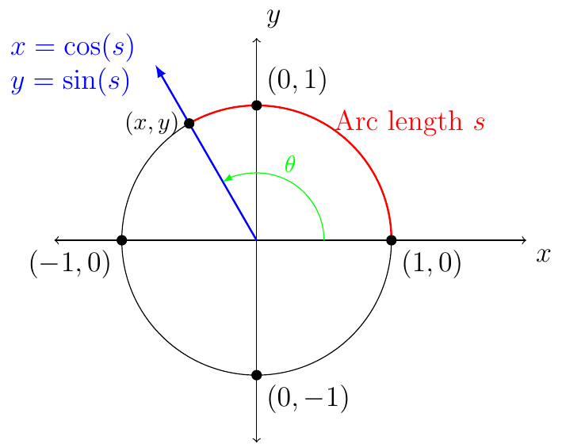

# Section 3.3

:::{prf:definition}
:label: unitCircleDef

A circle centered at $(0,0)$ and has a radius of $1$ unit is called the **unit circle**.

:::

The following functions are defined for any real number $s$ represented
by a directed arc on the unit circle.

\begin{align*}\cos(s) & =x & \sin(s) & =y & \tan(s) & =\dfrac{y}{x}\\
\sec(s) & =\frac{1}{x} & \csc(s) & =\frac{1}{y} & \cot(s) & =\dfrac{x}{y}
\end{align*}

The sine and cosine function is the set of all $x$ such that $x$ is an element of the real numbers.

Tangent and secant function is the set of all $x$ such that $x\ne(2n+1)\cdot\frac{\pi}{2}$ where $n$ is any integer,

$$
\{x\,|\,n\in\Z\land x\ne(2n+1)\cdot\frac{\pi}{2}\}.
$$

Cotangent and cosecant function is the set of all $x$ such that $x\ne(2n)\cdot\frac{\pi}{2}$ where $n$ is any integer,

$$
\{x\,|\,n\in\Z\land x\ne(2n)\cdot\frac{\pi}{2}\}=\{x\,|\,n\in\Z\land x\ne n\pi\}
$$

::::{prf:example}
:label: cotermRefRadExam

First, find the coterminal angle such that $\theta_{c}\in[0,2\pi)$, then find the reference angle $\theta'$.

$\frac{13\pi}{4}$

:::{dropdown} Solution:

\begin{align*}
\frac{13\pi}{4}-2\pi & =\frac{5\pi}{4}\in[0,2\pi)\implies\theta_{c}=\frac{5\pi}{4}\\
\theta_{c}=\frac{5\pi}{4} & \implies\theta'=\frac{\pi}{4}
\end{align*}

:::

$\frac{17\,\pi}{6}$

:::{dropdown} Solution:

\begin{align*}
\dfrac{17\pi}{6}-2\pi & =\frac{5\pi}{6}\in[0,2\pi)\implies\theta_{c}=\dfrac{5\pi}{6}\\
\theta_{c}=\frac{5\pi}{6} & \implies\theta'=\frac{\pi}{6}
\end{align*}

:::

$\frac{13\,\pi}{3}$

:::{dropdown} Solution:

\begin{align*}
\dfrac{13\pi}{3}-2\pi & =\frac{7\pi}{3}\notin[0,2\pi)\\
\dfrac{7\pi}{3}-2\pi & =\frac{\pi}{3}\in[0,2\pi)\implies\theta_{c}=\frac{\pi}{3}\\
\theta_{c}=\frac{\pi}{3} & \implies\theta'=\frac{\pi}{3}
\end{align*}

:::

$-\frac{2\,\pi}{3}$

:::{dropdown} Solution:

\begin{align*}
-\frac{2\pi}{3}+2\pi & =\frac{4\pi}{3}\in[0,2\pi)\implies\theta_{c}=\dfrac{4\pi}{3}\\
\theta_{c}=\dfrac{4\pi}{3} & \implies\theta'=\frac{\pi}{3}
\end{align*}

:::

$-\frac{19\,\pi}{6}$

:::{dropdown} Solution:

\begin{align*}
-\dfrac{19\pi}{6}+2\pi & =-\frac{7\pi}{6}\notin[0,2\pi)\\
-\dfrac{7\pi}{6}+2\pi & =\frac{5\pi}{6}\in[0,2\pi)\implies\theta_{c}=\dfrac{5\pi}{6}\\
\theta_{c}=\dfrac{5\pi}{6} & \implies\theta'=\dfrac{\pi}{6}
\end{align*}

:::

$-\frac{\pi}{4}$

:::{dropdown} Solution:

\begin{align*}
-\frac{\pi}{4}+2\pi & =\frac{7\pi}{4}\in[0,2\pi)\implies\theta_{c}=\dfrac{7\pi}{4}\\
\theta_{c}=\dfrac{7\pi}{4} & \implies\theta'=\dfrac{\pi}{4}
\end{align*}

:::

::::

{prf:example}
:label: evalTrigRadExam

Find the exact values of the following:

$\cos(\frac{11\,\pi}{3})$

:::{dropdown} Solution:

\begin{align*}
\dfrac{11\pi}{3}-2\pi & =\frac{5\pi}{3}\in[0,2\pi)\\
 & \implies\theta_{c}=\dfrac{5\pi}{3}\land\theta_{c}\in(\frac{3\pi}{2},2\pi)\subseteq[0,2\pi)\\
 & \implies\cos(\theta_{c})>0\\
\\\theta_{c}=\frac{5\pi}{3} & \implies\theta'=\frac{\pi}{3}\\
\\\therefore\cos(\frac{11\pi}{3}) & =\cos(\frac{\pi}{3})\\
 & =\dfrac{1}{2}
\end{align*}

:::

$\sin(-\frac{5\,\pi}{4})$

:::{dropdown} Solution:

\begin{align*}
-\dfrac{5\pi}{4}+2\pi & =\frac{3\pi}{4}\in[0,2\pi)\\
 & \implies\theta_{c}=\dfrac{3\pi}{4}\land\theta_{c}\in(\frac{\pi}{2},\pi)\subseteq[0,2\pi)\\
 & \implies\sin(\theta_{c})>0\\
\\\theta_{c}=\dfrac{3\pi}{4} & \implies\theta'=\dfrac{\pi}{4}\\
\\\therefore\sin(-\frac{5\pi}{4}) & =\sin(\frac{\pi}{4})\\
 & =\dfrac{\sqrt{2}}{2}
\end{align*}

:::

$\tan(\frac{11\,\pi}{2})$

:::{dropdown} Solution:

\begin{align*}
\dfrac{11\pi}{2}-2\pi & =\frac{7\pi}{2}\notin[0,2\pi)\\
\dfrac{7\pi}{2}-2\pi & =\frac{3\pi}{2}\in[0,2\pi)\\
 & \implies\theta_{c}=\dfrac{3\pi}{2}
\end{align*}

If we consider $\tan(\frac{3\pi}{2})$ we would need to consider the fact that $\tan(\frac{3\pi}{2})=\dfrac{\sin(\frac{3\pi}{2})}{\cos(\frac{3\pi}{2})}$ and we must notice that $\cos(\frac{3\pi}{2})=0$. Therefore, $\tan(\dfrac{3\pi}{2})$ is undefined, which also means $\tan(\frac{11\pi}{2})$ is undefined.

:::
