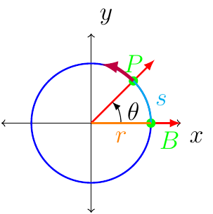

# Section 3.4

The following image will drive the conversation for this section:

The path of the point P what moves at a constant speed along the circle.

:::{prf:definition} Linear Speed
:label: linearSpeedDef

The measure of how fast the position of $P$ is changing is **linear speed**. If $v$ represents linear speed, then

$$
\text{speed}=v=\dfrac{\text{distance}}{\text{time}}=\dfrac{s}{t}
$$

where $s=r\theta$.

:::

:::{prf:definition} Angular Speed
:label: angSpeedDef

As point $P$ moves along the circle, the ray $\overrightarrow{OP}$ is the terminal side of $\angle POB$, the measure of the angle changes as $P$ moves along the circle.

The measure of how fast $\angle POB$ is changing is called the **angular speed** and is defined as

$$
\omega=\dfrac{\theta}{t}
$$

where $\theta$ must be in units of radians.

:::

Linear speed is defined as

$$
v=\frac{s}{t}
$$

where $s=r\theta$. This yields:
\begin{align*}
v & =\dfrac{s}{t}\\
 & =\dfrac{r\theta}{t}\\
 & =r\cdot\frac{\theta}{t}\\
 & =r\omega
\end{align*}

Therefore, $v=\frac{s}{t}$ or $v=r\omega$.

::::{prf:example}
:label: angLinSpeedQuest

Suppose that $P$ is on a circle with radius 15 inches and $\overrightarrow{OP}$ is is rotating with angular speed of $\frac{\pi}{12}$ radians per
second.

Find the angle generated by $P$ in 10 seconds.

:::{dropdown} Solution:

Since $\omega=\frac{\pi}{12}$ and $\omega=\frac{\theta}{t}$ where $t=10$ we have

\begin{align*}
\frac{\pi}{12} & =\frac{\theta}{10}\\
\theta & =\frac{10\pi}{12}\\
 & =\frac{5\pi}{6}
\end{align*}

:::

Find the distance traveled by $P$ along the circle in 10 seconds.

:::{dropdown} Solution:

Given $r=15$ and $\theta=\frac{5\pi}{6}$ we have 

\begin{align*}
s & =r\theta\\
 & =15\cdot\frac{5\pi}{6}\\
 & =\frac{25\pi}{2}
\end{align*}

The units would be inches.

:::

Find the linear speed of $P$ in inches per second.

:::{dropdown} Solution:

First, we could use $v=r\omega$ where $r=15$ and $\omega=\frac{\pi}{12}$.

This gives

\begin{align*}
v & =15\cdot\frac{\pi}{12}\\
 & =\frac{5\pi}{4}
\end{align*}

and the units would be inches per second.

Alternatively, we could use the $v=\frac{s}{t}$ where 

$$
s=15\cdot\frac{5\pi}{6}=\frac{25\pi}{2}
$$

and $t=10.$ Thus,

\begin{align*}
v & =\frac{\frac{25\pi}{2}}{10}\\
 & =\frac{25\pi}{20}\\
 & =\frac{5\pi}{4}
\end{align*}

The units is still inches per second.

:::

::::

::::{prf:example}
:label: pulleyExam

A belt runs a pulley of radius 5 centimeters at 120 revolutions per minute.

Find the angular speed of the pulley in radians per second.

:::{dropdown} Solution:

Since 1 revolution is $2\pi$ and 1 minute is 60 seconds, we have the following using dimensional analysis

\begin{align*}
\frac{120\text{ rev}}{1\text{ min}}\cdot\left(\frac{1\text{ min}}{1\text{ min}}\right)\cdot\left(\frac{1\text{ rev}}{1\text{ rev}}\right) & =\frac{120\cancel{\text{ rev}}}{1\cancel{\text{ min}}}\cdot\left(\frac{1\cancel{\text{ min}}}{60\text{ sec}}\right)\cdot\left(\frac{2\pi\text{ rad}}{1\cancel{\text{ rev}}}\right)\\
 & =\frac{120\cdot(2\pi)}{60}\frac{\text{rad}}{\text{sec}}\\
 & =4\pi\frac{\text{rad}}{\text{sec}}
\end{align*}

:::

Find the linear speed of the belt in centimeters per second.

:::{dropdown} Solution:

Since $\omega=4\pi$ and $r=5$ we have
\begin{align*}
v & =r\omega\\
 & =5\cdot(4\pi)\\
 & =20\pi
\end{align*}
centimeters per seconds.

:::

::::
