# Section 4.1

:::{prf:definition}
:label: periodDef

A periodic function is a function $f$ such that

$$
f(x)=f(x+np),
$$

for every real number $x$ in the domain of $f$, every integer $n$, and some positive real number $p$. The least possible positive value of $p$ is the period of the function.

:::

The sine and cosine function are periodic functions with period $2\pi$. That is,

\begin{align*}
\cos(x) & =\cos(x+2\pi n)\\
\sin(x) & =\sin(x+2\pi n)
\end{align*}

for any integer $n$.

## Graph of the Sine Function

* The domain of the sine function is the set of all real numbers.
* The range of the sine function is the interval $[-1,1]$. This means for all real number $x$, we have, $-1\le \sin(x)\le 1$.

Some key values when plotting the sine function:

|$x$|$\sin(x)$|
|:-:|:-:|
|$0$|$0$|
|$\frac{\pi}{2}$|$1$|
|$\pi$|$0$|
|$\frac{3\pi}{2}$|$-1$|
|$2\pi$|$0$|

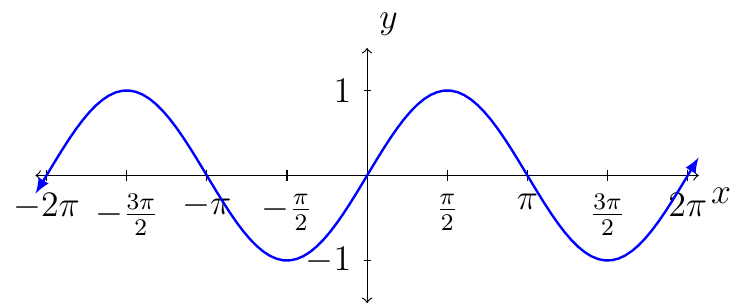

* The sine function is continuous everywhere.
* The length of one period for the sine function is $2\pi$.
* The graph of the sine function is symmetric about the origin.  
  * This mean the sine function is odd.
  * That is, $\sin(-x)=-\sin(x)$.

## Grpah of the Cosine Function

* The domain of the cosine function is the set of real numbers.
* The range of the cosine function is the interval $[-1,1]$. That is, for all $x$ in the real numbers, we have, $-1\le \cos(x)\le 1$.

Some key values when plotting the cosine function:

|$x$|$\cos(x)$|
|:-:|:-:|
|$0$|$1$|
|$\frac{\pi}{2}$|$0$|
|$\pi$|$-1$|
|$\frac{3\pi}{2}$|$0$|
|$2\pi$|$1$|

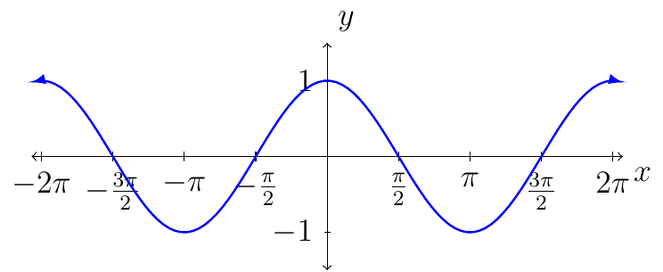

* The cosine function is continuous everywhere.
* The length of one period for the cosine function is $2\pi$.
* The graph of the cosine function is symmetric about the $y$-axis.  
  * This mean the sine function is even.
  * That is, $\cos(-x)=\cos(x)$.

## Graph of $y=A\cos(x)$ and $y=A\sin(x)$

:::{prf:definition} Amplitude
:label: ampDef

The graph of $y=A\sin(x)$ or $y=A\cos(x)$, with $a\ne0$, will have the same shape as the graph of $y=\sin(x)$ or $y=\cos(x),$respectively, except with the range of $-|A|\le y\le|A|$.

The **amplitude** is $|A|$.

:::

::::{prf:example}
:label: AcosxExam

Plot the graph of $y=2\cos(x)$.

:::{dropdown} Solution:

The amplitude of the graph is $|2|=2$.

Let $x=\{0,\frac{\pi}{2},\pi,\frac{3\pi}{2},2\pi \}$. Then consider the following table of values:

|x|$y=\cos(x)$|$y=2\cos(x)$|
|:-:|:-:|:-:|
|$0$|$1$|$2$|
|$\frac{\pi}{2}$|$0$|$0$|
|$\pi$|$-1$|$-2$|
|$\frac{3\pi}{2}$|$0$|$0$|
|$2\pi$|$1$|$2$|

From the table we see that we want to plot the following points:

$$(0,2),(\frac{\pi}{2},0),(\pi,-2),(\frac{3\pi}{2},0),(2\pi,2)$$

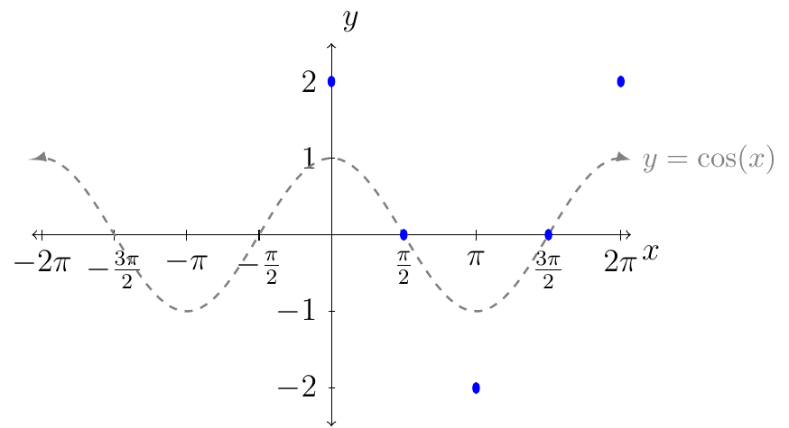

Next, we connect the dots following the behavior of the curves from the graph of $y=\cos(x)$ (as shown in gray).

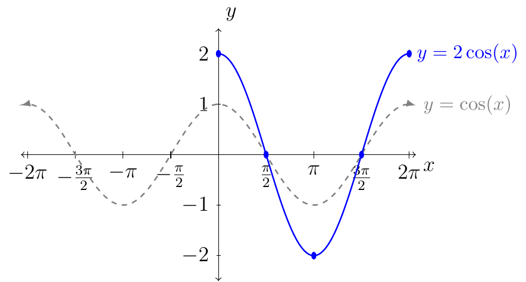

Above is the graph of $y=2\cos(x)$ over one period. To represent the graph of $y=2\cos(x)$ over its domain we have.

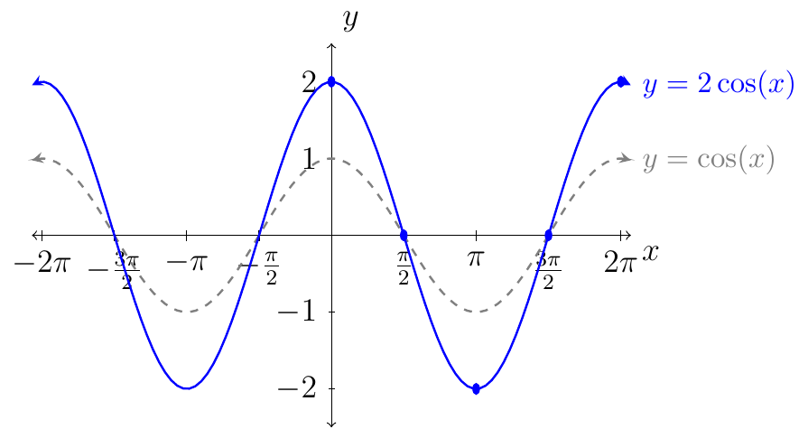

:::

::::

::::{prf:example}
:label: AsinxExam

Plot $y=\frac{1}{2}\sin(x)$.

:::{dropdown} Solution:

The amplitude of the graph is $|\frac12|=\frac12$.

Let $x=\{0,\frac{\pi}{2},\pi,\frac{3\pi}{2},2\pi \}$. Then consider the following table of values:

|$x$|$\sin(x)$|$\frac12 \sin(x)$|
|:-:|:-:|:-:|
|$0$|$0$|$0$|
|$\frac{\pi}{2}$|$1$|$\frac12$|
|$\pi$|$0$|$0$|
|$\frac{3\pi}{2}$|$-1$|$-\frac12$|
|$2\pi$|$0$|$0$|

From the table we see that we want to plot the following points:

$$(0,0),(\frac{\pi}{2},\frac12),(\pi,0),(\frac{3\pi}{2},-\frac12),(2\pi,0)$$

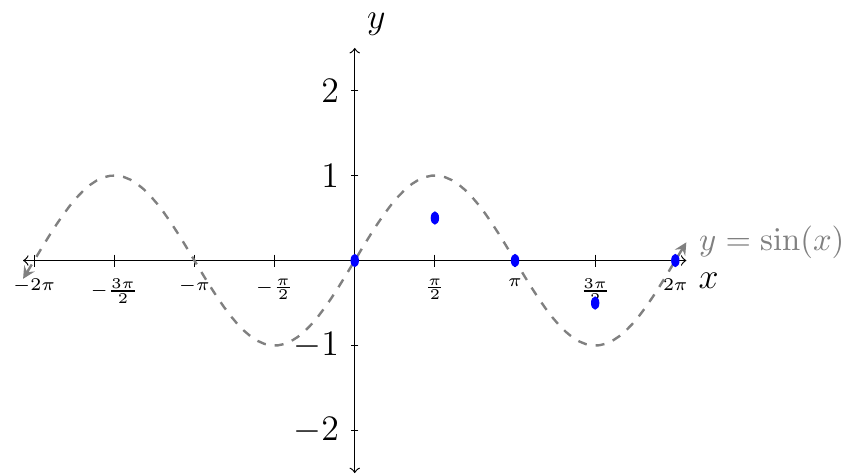

Next, we connect the dots following the behavior of the curves from the graph of $y=\sin(x)$ (as shown in gray).

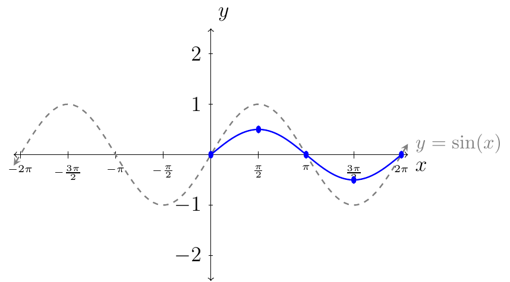

Above is the graph of $y=\frac12 \sin(x)$ over one period. To represent the graph of $y=\frac12 \sin(x)$ over its domain we have.

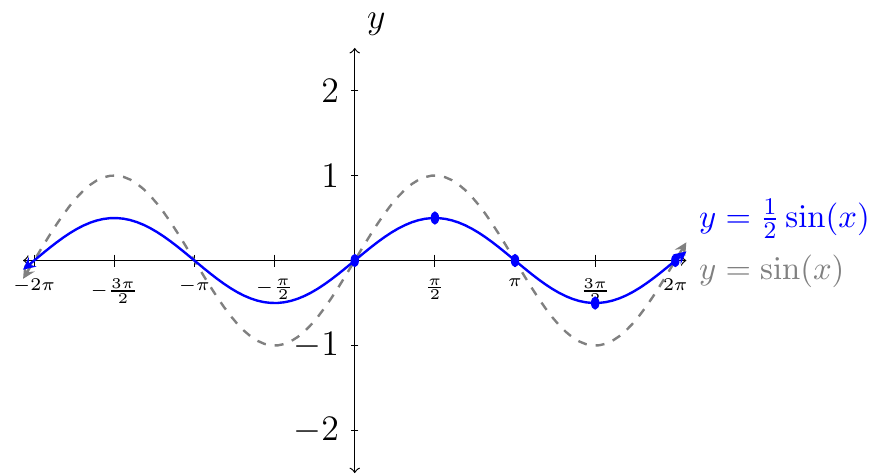

:::
::::

## Graph of $y=\cos(Bx)$ and $y=\sin(Bx)$

For $b>0$, the graph of $y=\sin(Bx)$ will resemble that of $y=\sin(x)$, but with period $\frac{2\pi}{b}$. Also, the graph of $y=\cos(Bx)$ will resemble that of $y=\cos(x)$, but with period $\frac{2\pi}{B}$.

::::{prf:example}
:label: sinthreefourthsxExam

Plot $y=\sin(\frac34 x)$.

:::{dropdown} Solution:

First, we see that the amplitude is $1$.

Second, we want to compute the new period. In this case $B=\frac34$. Using $\frac{2\pi}{B}$ the new period is:

\begin{align*}
    \frac{2\pi}{\frac34} & = \frac{4\cdot 2 \pi}{3}\\
    & = \frac{8\pi}{3}
\end{align*}

This means the graph of $y=\sin(\frac34 x)$ over one period will be over the interval $[0,\frac{8\pi}{3}]$. Next, we want to split the period interval into four equal length subintervals. To do this we first find

$$\Delta x = \frac{P}{4} = \frac{\frac{8\pi}{3}}{4}=\frac{2\pi}{3}$$

Since we are starting at $x_0=0$, we know that $x_1=x_0+1\Delta x$. Then we will do this up to $x_4$. That is,

\begin{align*}
    x_0 & = 0 + 0 \cdot (\frac{2\pi}{3})=\frac{0\pi}{3}\text{ or } 0\\
    x_1 & = 0 + 1 \cdot (\frac{2\pi}{3})=\frac{2\pi}{3}\\
    x_2 & = 0 + 2 \cdot (\frac{2\pi}{3})=\frac{4\pi}{3}\\
    x_3 & = 0 + 3 \cdot (\frac{2\pi}{3})=\frac{6\pi}{3}\text{ or } 2\pi\\
    x_4 & = 0 + 4 \cdot (\frac{2\pi}{3})=\frac{8\pi}{3}\\
\end{align*}

Next, evaluate $y=\sin(\frac34 x)$ at $x_0$, $x_1$, $x_2$, $x_3$, and $x_4$.

| |$x_i$|$\frac34 x_i$|$y=\sin(\frac34 x_i)$|
|:-:|:-:|:-:|:-:|
|$x_0$|$0$|$0$|$0$|
|$x_1$|$\frac{2\pi}{3}$|$\frac{\pi}{2}$|$1$|
|$x_2$|$\frac{4\pi}{3}$|$\pi$|$0$|
|$x_3$|$2\pi$|$\frac{3\pi}{2}$|$-1$|
|$x_4$|$\frac{8\pi}{3}$|$2\pi$|$0$|

From the table we then plot the following points:

$$(0,0), (\frac{2\pi}{3},1),(\frac{4\pi}{3},0),(2\pi,-1),(\frac{8\pi}{3},0)$$

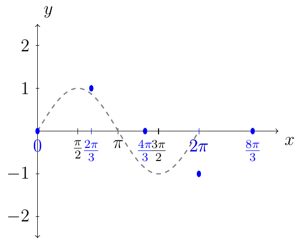

Next, complete the curve through the points for a plot of one period for the graph of $y=\sin(\frac34 x)$.

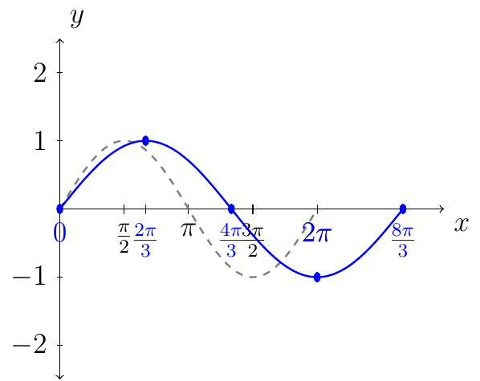

:::
::::

::::{prf:example}
:label: sinthreefourthsxExam

Plot $y=2\cos(3 x)$.

:::{dropdown} Solution:

First, we see that the amplitude is $2$.

Second, we want to compute the new period. In this case $B=3$. Using $\frac{2\pi}{B}$ the new period is:

$$\frac{2\pi}{3}$$

This means the graph of $y=2\cos(3 x)$ over one period will be over the interval $[0,\frac{2\pi}{3}]$. Next, we want to split the period interval into four equal length subintervals. To do this we first find

$$\Delta x = \frac{P}{4} = \frac{\frac{2\pi}{3}}{4}=\frac{\pi}{6}$$

Since we are starting at $x_0=0$, we now that $x_1=x_0+1\Delta x$. Then we will do this up to $x_4$. That is,

\begin{align*}
    x_0 & = 0 + 0 \cdot (\frac{\pi}{6})=\frac{0\pi}{6}\text{ or } 0\\
    x_1 & = 0 + 1 \cdot (\frac{\pi}{6})=\frac{\pi}{6}\\
    x_2 & = 0 + 2 \cdot (\frac{\pi}{6})=\frac{2\pi}{6}\text{ or } \frac{\pi}{3}\\
    x_3 & = 0 + 3 \cdot (\frac{\pi}{6})=\frac{3\pi}{6}\text{ or } \frac{\pi}{2}\\
    x_4 & = 0 + 4 \cdot (\frac{\pi}{6})=\frac{4\pi}{6}\text{ or } \frac{2\pi}{3}\\
\end{align*}

Next, evaluate $y=2\cos(3 x)$ at $x_0$, $x_1$, $x_2$, $x_3$, and $x_4$.

| |$x_i$|$3 x_i$|$y=2\cos(3 x_i)$|
|:-:|:-:|:-:|:-:|
|$x_0$|$0$|$0$|$2$|
|$x_1$|$\frac{\pi}{6}$|$\frac{\pi}{2}$|$0$|
|$x_2$|$\frac{\pi}{3}$|$\pi$|$-2$|
|$x_3$|$\frac{\pi}{2}$|$\frac{3\pi}{2}$|$0$|
|$x_4$|$\frac{2\pi}{3}$|$2\pi$|$2$|

From the table we then plot the following points:

$$(0,2), (\frac{\pi}{6},0),(\frac{\pi}{3},-2),(\frac{\pi}{2},0),(\frac{2\pi}{3},2)$$

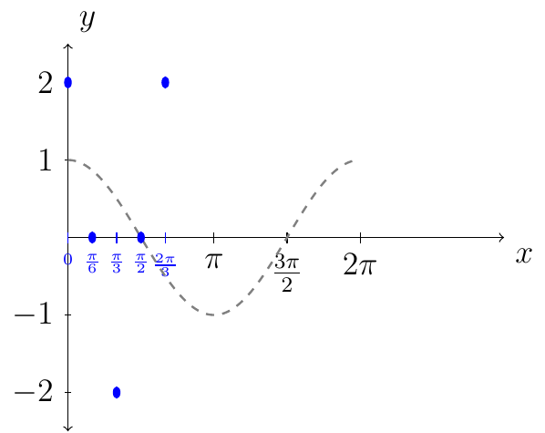

Next, complete the curve through the points for a plot of one period for the graph of $y=2\cos(3 x)$.

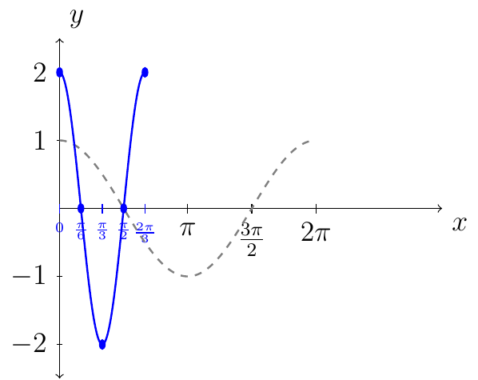

:::
::::

## Graph of $y=\cos(x)$ and $y=\sin(x)$ with Reflections

Given the graph of $y=f(x)$. We know the graph of $y=-f(x)$ is the graph of $y=f(x)$ but reflected about the $x$-axis.

Given the graph of $y=g(x)$. We know the graph of $y=g(-x)$ is the graph of $y=g(x)$ but reflected about the $y$-axis.

For example: $y=-\cos(x)$ where $x\in[0,2\pi]$.

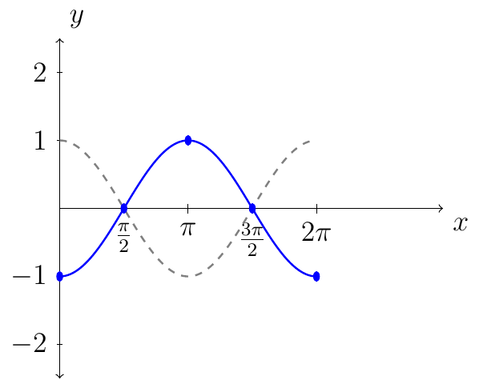

Another example: $y=\sin(-x)$ where $x\in[-2\pi,2\pi]$. The solid blue line shows the reflection with respect to the gray dashed line.

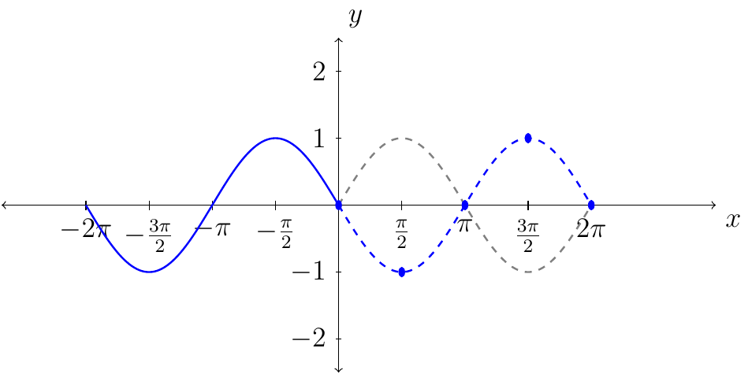
