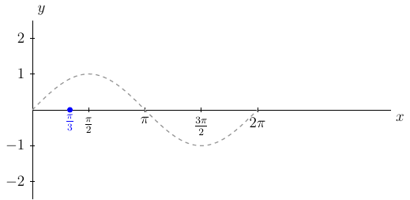

# Section 4.2

Let $y=f(x)$ be a plot of some graph. Then $f(x-h)$ will be the plot of $y=f(x)$ but with a horizontal shift of $h$ units.

{prf:example}
:label: hozShiftSine1

Plot $y=\sin(x-\frac{\pi}{3})$

{dropdown} Solution:

First, we see that the magnitude is $1$.

Second, we say $\sin(x-\frac{\pi}{3})=\sin(1(x-\frac{\pi}{3}))$, $B=1$, and using $\frac{2\pi}{B}$ we see the period is

$$P=\frac{2\pi}{B}=\frac{2\pi}{1}=2\pi$$

Third, given $\sin(1(x-\frac{\pi}{3}))$ we know that the phase shift is right $\frac{\pi}{3}$ units. 

This means the graph of $y=\sin(x-\frac{\pi}{3})$ over one period will be over the interval $[0+\frac{\pi}{3},2\pi+\frac{\pi}{3}]=[\frac{\pi}{3},\frac{7\pi}{3}]$. Next, we want to split the period interval into four equal length subintervals. To do this we first find

$$\Delta x = \frac{2\pi}{4}=\frac{\pi}{2}$$

and

$$x_i=x_0+i\Delta x$$

)

Since we are starting at $x_0=\frac{\pi}{3}$, we know that $x_1=x_0+1\Delta x$. Then we will do this up to $x_4$. That is,

\begin{align*}
    x_0 & = \frac{\pi}{3} + 0 \cdot (\frac{\pi}{2})=\frac{\pi}{3}\\
    x_1 & = \frac{\pi}{3} + 1 \cdot (\frac{\pi}{2})=\frac{5\pi}{6}\\
    x_2 & = \frac{\pi}{3} + 2 \cdot (\frac{\pi}{2})=\frac{4\pi}{3}\\
    x_3 & = \frac{\pi}{3} + 3 \cdot (\frac{\pi}{2})=\frac{11\pi}{6}\\
    x_4 & = \frac{\pi}{3} + 4 \cdot (\frac{\pi}{2})=\frac{7\pi}{3}\\
\end{align*}