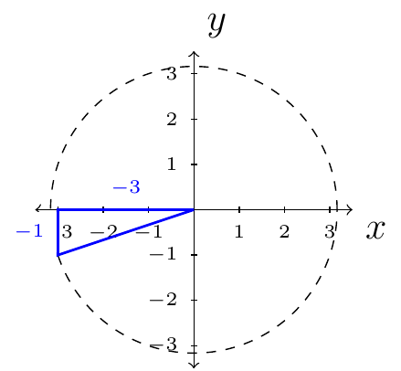

# Section 5.1

In this section we recall the fundamental identities for trigonometric functions.

For, example $\cos(-x)=\cos(x)$ and $\sin(-x)=-\sin(x)$. Later, will we also need to remember:

Given $x^2+y^2=r^2$ (a circle with radius $r$), we have,

\begin{align*}
    \cos(\theta)=\frac{x}{r} && \sin(\theta)=\frac{y}{r} && \tan(\theta)=\frac{y}{x}\\
    \sec(\theta)=\frac{r}{x} && \csc(\theta)=\frac{r}{y} && \cot(\theta)=\frac{x}{y}
\end{align*}

We also have the **reciprocal identities**

\begin{align*}
    \cot(\theta)=\frac{1}{\tan(\theta)} && \sec(\theta)=\frac{1}{\cos(\theta)} && \csc(\theta)=\frac{1}{\sin(\theta)}
\end{align*}

The **quotient identities**

\begin{align*}
    \tan(\theta)=\frac{\sin(\theta)}{\cos(\theta)} && \cot(\theta)=\frac{\cos(\theta)}{\sin(\theta)}
\end{align*}

One of the most important identities that will be used through this chapter is

$$\cos^2(\theta)+\sin^2(\theta)=1$$

By dividing both sides by $\cos^2(\theta)$ we then get

$$1+\tan^2(\theta)=\sec^2(\theta)$$

Or dividing both sides by $\sin^2(\theta)$ we then get

$$\cot^2(\theta)+1=\csc^2(\theta)$$

As a consequence of those three identities we have

\begin{align*}
    \cos^2(\theta)&=1-\sin^2(\theta) & \sin^2(\theta)&=1-\cos^2(\theta)\\
    &=(1-\sin(\theta))(1+\sin(\theta)) && =(1-\cos(\theta))(1+\cos(\theta))\\\\
    \tan^2(\theta) & =\sec^2(\theta)-1 & \cot^2(\theta) & = \csc^2(\theta)-1
\end{align*}

This may look like a lot to remember; however, only one identity must be memorized: $\cos^2(\theta)+\sin^2(\theta)=1$. All of the other identities "spawn" from that identity. We call this identity, Pythagorean Identity.

::::{prf:example}
:label: 51exam1

If $\tan(\theta)=\frac{1}{3}$ and $\theta$ is in quadrant three, then find $\sin(\theta)$ and $\cos(\theta)$.

:::{dropdown} Solution:

First, we will construct the triangle involving this situation:

The hypotenuse of this triangle is

\begin{align*}
    h^2 & = (-3)^2+(-1)^2\\
    & = 10\\
    h & = \sqrt{10}
\end{align*}

We have $x=-3$, $y=-1$, and $h=\sqrt{10}$. Therefore,

$$\cos(\theta)=\frac{-3}{\sqrt{10}}$$

and

$$\sin(\theta)=\frac{-1}{\sqrt{10}}$$

:::
::::

::::{prf:example}
:label: 51exam2

Write $\dfrac{1+\tan^{2}(\theta)}{1-\sec^{2}(\theta)}$ in terms of $\sin(\theta)$ and $\cos(\theta)$. Then simplify the expression so that there are no quotients by using the quotient identities or reciprocal identities.

:::{dropdown} Solution:

First, we will directly substitute cosine and sine into the original
expression

$$
\dfrac{1+\tan^{2}(\theta)}{1-\sec^{2}(\theta)}=\dfrac{1+\dfrac{\sin^{2}(\theta)}{\cos^{2}(\theta)}}{1-\dfrac{1}{\cos^{2}(\theta)}}.
$$

Second, we will simplify

\begin{align*}
\dfrac{1+\dfrac{\sin^{2}(\theta)}{\cos^{2}(\theta)}}{1-\dfrac{1}{\cos^{2}(\theta)}} & =\dfrac{\frac{\cos^{2}(\theta)+\sin^{2}(\theta)}{\cos^{2}(\theta)}}{\frac{\cos^{2}(\theta)-1}{\cos^{2}(\theta)}}\\
 & =\dfrac{\cos^{2}(\theta)+\sin^{2}(\theta)}{\cos^{2}(\theta)-1}\\
 & =\dfrac{1}{-\left(1-\cos^{2}(\theta)\right)}\\
 & =\dfrac{1}{-\sin^{2}(\theta)}.
\end{align*}

Finally, we will rewrite $-\dfrac{1}{\sin^{2}(\theta)}$.

$$
-\dfrac{1}{\sin^{2}(\theta)}=-\csc^{2}(\theta).
$$

:::
::::
